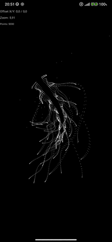
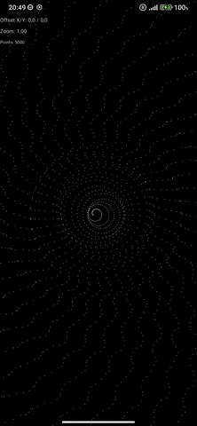
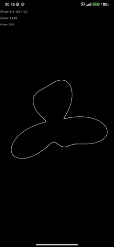

# KArtliner


**KArtliner** est un projet Android expérimental qui transforme des fonctions mathématiques ultra-courtes en animations graphiques temps réel, à l'aide de Jetpack Compose.

Inspiré de **Processing**, **p5.js**, **code golf**, et de l’art génératif, KArtliner permet de dessiner des formes visuelles complexes à partir de **fonctions one-liner** ou d’expressions compactes.


---


## 💡 Concept

> Une fonction mathématique → un monde visuel.

KArtliner propose un environnement minimal pour créer des **dessins dynamiques à partir d'expressions mathématiques**, dans l'esprit de :

- ✍️ *"function drawing"* : `(i, t) → Offset(x, y)`
- 🧪 *code golf créatif* : une ligne de code qui génère une animation
- ⚡ *rendu temps réel* avec `Canvas` Jetpack Compose
- 🧠 *expérimentation mathématique visuelle* sur mobile

---

## ✨ Fonctionnalités

-  Animation fluide à 30–60 fps via `InfiniteTransition` Compose
-  Support de fonctions mathématiques paramétrées `(i, t, size) → Offset`
-  Rendu vectoriel performant via `Canvas` Compose (accélération Skia GPU)
-  Architecture modulaire et flexible pour tester facilement d’autres formules
-  Gestion intelligente de la charge : 3k–5k points max par frame pour conserver la fluidité
-  Parsing dynamique d’expressions `String` pour éditer et tester des formules en live
-  Sauvegarde et partage des fonctions en format one-liner compact


---

## 🔣 Exemple de fonction Kotlin

```kotlin
val waveFunc: GenerativeFunc = { i, t, _ ->
    val x = i.toFloat()
    val y = i / 235f
    val k = (4f + sin(y * 2f - t) * 3f) * cos(x / 29f)
    val e = y / 8f - 13f
    val d = hypot(k, e)
    val q = 3f * sin(k * 2f) + 0.3f / d + sin(y / 25f) * k * (9f + 4f * sin(e * 9f - d * 3f + t * 2f))
    val c = d - t
    val px = q + 30f * cos(c) + 200f
    val py = q * sin(c) + d * 39f - 220f
    Offset(px, py)
}
```

---

## 📸 Screenshots

| Alien life | Spiral Galaxy | Chaos Bloom |
|:---:|:---:|:---:|
|  |  |   |

---


## Parser maison & expressions dynamiques

Pour faciliter la création de fonctions personnalisées, on travaille sur un **parser léger maison** capable d’interpréter des expressions mathématiques basiques :

- Fonctions supportées : `sin`, `cos`, `tan`, `hypot`, opérations `+`, `-`, `*`, `/`
- Variables disponibles : `i` (index du point), `t` (temps), `size` (taille du canvas)
- Exemple d’expression éditable :

```kotlin
(4 + sin(y*2 - t)*3)*cos(x/29)
```

Ce parser convertira la chaîne en une lambda Kotlin dynamique `(i, t, size) -> Offset`, directement utilisable dans le rendu Compose.

Si le besoin s’en fait sentir, on pourra intégrer des bibliothèques spécialisées comme `exp4j` ou `mXparser` pour supporter des expressions plus complexes.

Cette approche permettra la création d’un **éditeur live**, où l’utilisateur pourra écrire, tester et sauvegarder ses propres formules visuelles en temps réel.

---

## 🔄 Fonction one-liner / code golf visuel

Dans l’esprit minimaliste et créatif du projet, on prévoit une fonctionnalité qui :

- Convertit une fonction Kotlin en une **chaîne de caractères compacte, one-liner**, prête à copier-coller
- Facilite le partage et la réutilisation des formules dans l’éditeur
- Assure un format lisible et exploitable à la manière des snippets Processing/p5.js
- Permet de générer des œuvres visuelles partagées via des lignes de code simples

---

## 🚧 Roadmap
 - Base fonctionnelle avec Canvas animé
 - Évaluateur d’expressions String façon p5.js
 - Sliders dynamiques pour les paramètres
 - Export PNG
 - Galerie de presets
 - UI pour composer/éditer les fonctions live

---

## 🔧 Dépendances techniques

- Kotlin  
- Jetpack Compose (Canvas, Animation, UI)  
- (À venir) Bibliothèque d’évaluation d’expressions mathématiques (`exp4j`, `mXparser`, ou moteur custom)  

---

## 🎯 Objectifs secondaires

- Étudier les limites CPU et GPU du rendu vectoriel Compose sur mobile
- Offrir un bac à sable visuel pour créer des œuvres algorithmiques variées
- Mettre en avant des fonctions mathématiques expressives et minimalistes
- Expérimenter la fusion du code golf et de l’art génératif sur Android


---


## 🧠 Inspirations

- [Processing](https://processing.org/)  
- [p5.js](https://p5js.org/)  
- [ShaderToy](https://www.shadertoy.com/)  
- [Code Golf Challenges](https://codegolf.stackexchange.com/)  
- Visualisation algorithmique et sketches paramétriques

---


